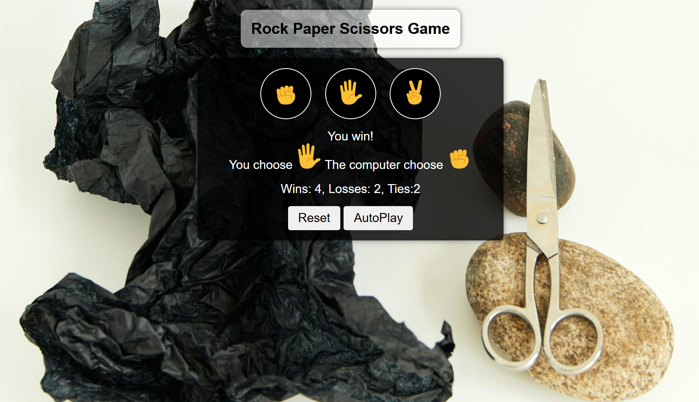

# Project Name: Rock-Paper-Scissors(using JavaScript)

## Overview

I created a Rock Paper and Scissors game using javascript.
Added some additional functionality of appropraite sound effects and autoplay feature.

## Live Demo

You can view the live version of this project [here](https://rishabh-verma-thc.github.io/rock-paper-scissors/).



## How to Run Locally

To get a local copy of this project up and running, follow these steps:

1. Clone the repository:
    ```bash
   git clone https://github.com/Rishabh-Verma-thc/rock-paper-scissors

2. Navigate to the Project directory:
    ```bash
    cd rock-paper-scissors

3. Open index.html in your web browser to view the website.
